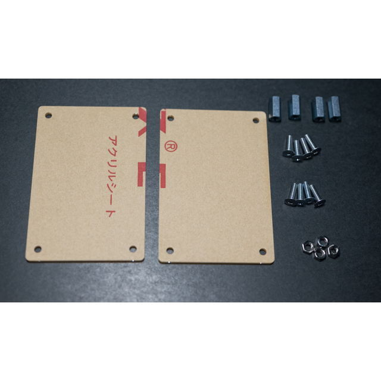
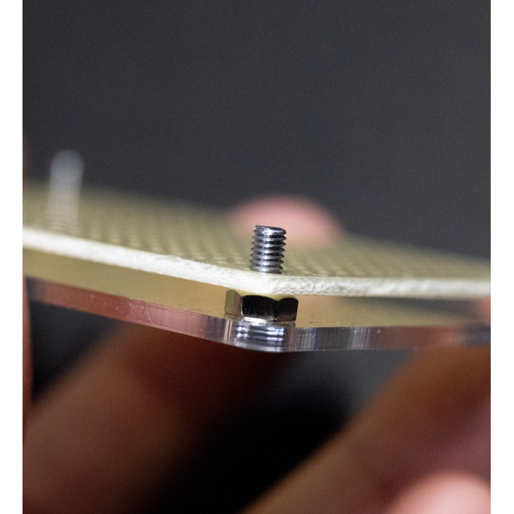

# AN-226 Ｃ基板用アクリルパネルセット（スペーサ・ネジ付き）

# 商品説明

C基板タイプの基板にピッタリなアクリルパネルです。

ネジとスペーサとナットを付属したので、これだけで化粧基板が出来上がります。

基板の展示や保管にピッタリです！

# 仕様

- 基板サイズ: C基板用
- アクリル厚：2.0mm
- ねじ穴:3.2mm　x4
- JANコード: 4589775472176	

# 内容物

- アクリルパネル    2枚
- 11mmスペーサ      4個
- 3ｘ10mmネジ       8個
- 3mmナット         4個
- ※予備で多めに入っている場合があります。

# 使用手順

- ①:アクリルに付いている保護シートを剥がします。
-    （剥がれにくい際は水に濡らして数分置いておくと剥がれやすくなります。）

- ②: ネジ ー アクリル ー ナットの順番で挟んで固定します

- ③: ナットの上に基板を乗せます。

- ④: 基板の上にスペーサーを載せます

- ⑤: 最後にスペーサーの上にアクリルを乗せ、ネジで固定します。

